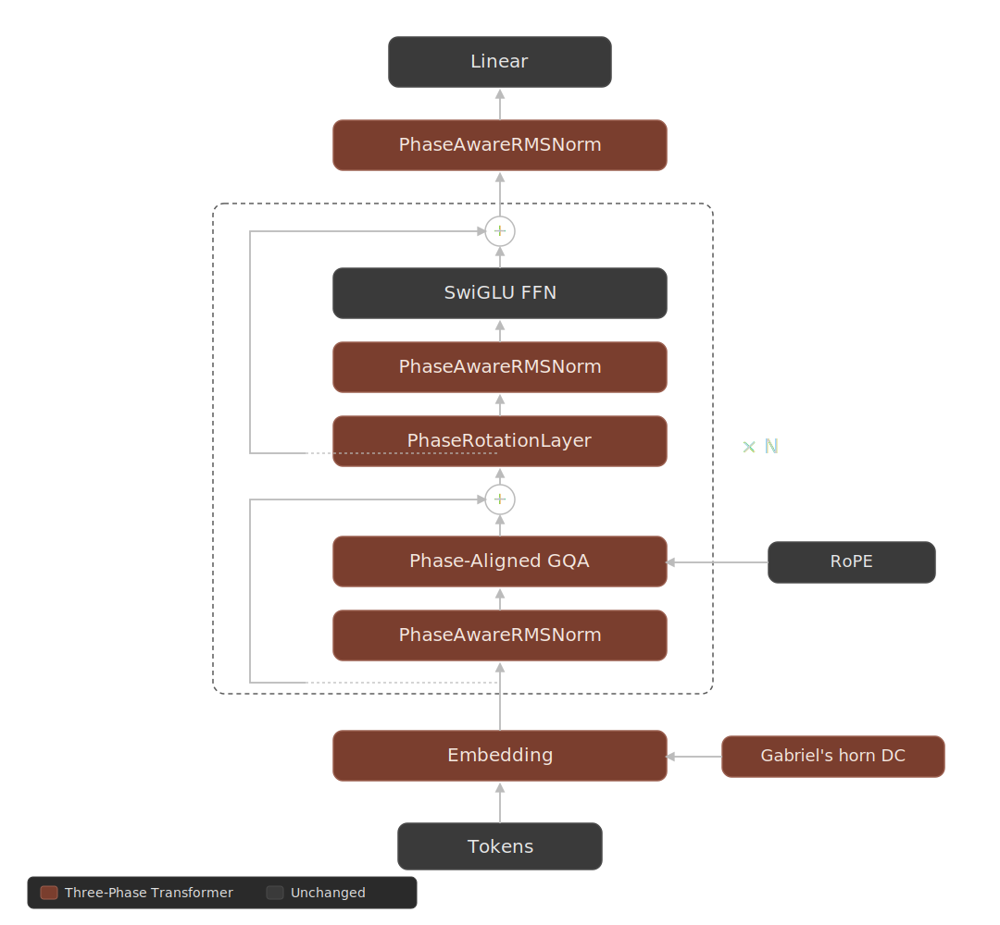

# Transformador de Tres Fases


**Un Prior Estructural de Flujo Residual para Transformers Solo Decodificador**

Mohammad R. Abu Ayyash - [Brains Build Research](https://github.com/achelousace), Ramalá, Palestina.

[](Paper/three_phase_paper.pdf)
[](LICENSE)

---

El Transformador de Tres Fases (3PT) es un prior estructural de flujo residual para Transformers solo decodificador. El vector oculto `d_model` se particiona en 3 canales cíclicos de igual tamaño ("fases A/B/C"), cada uno mantenido por un pequeño número de operaciones que respetan las fases y se distribuyen en cada bloque. La partición de canales talla geométricamente un subespacio unidimensional de CC ortogonal a los canales, en el que se inyecta un perfil fijo analítico de trompa de Gabriel `r(p) = 1/(p+1)` como un canal lateral de posición absoluta que se compone ortogonalmente con la rotación de posición relativa de RoPE en la atención. La arquitectura representa un equilibrio autoestabilizante entre la mezcla (atención, FFN) y la reaplicación (las operaciones sensibles a la fase), y no es un módulo añadido.

Con 123M de parámetros en WikiText-103, 3PT logra una **reducción del 7.20 % en la perplejidad (−2.62 % BPB)** frente a una línea base RoPE-Only equivalente, con solo **+1,536 parámetros entrenables (0.00124 % del total)**, y una **aceleración en la convergencia de 1.93× en el número de pasos** (1.64× en tiempo real, tras un sobrecoste del 17 % por paso). Toda modificación adicional más allá de los theta de rotación es libre de parámetros o neutra en parámetros.

## Arquitectura

3PT añade cinco modificaciones estructurales coordinadas sobre una base estándar de SwiGLU + RMSNorm + RoPE + GQA:

**1. Partición de canales de tres fases** - El flujo residual `d_model` se divide en 3 franjas contiguas de igual ancho interpretadas como componentes desplazados 120° en el sentido de corriente alterna de tres fases.

**2. Inyección CC de la trompa de Gabriel** - En cada pasada forward, se calcula la media CC inter-fases por posición del embedding a lo largo de las tres fases, se resta y se reemplaza por el valor de un perfil analítico fijo `r(p) = 1/(p+1)`. Buffer no aprendible; cero parámetros entrenables. El túnel 1D abierto por la partición de canales se convierte en un canal lateral de posición absoluta ortogonal a donde reside el contenido.

**3. PhaseRotationLayer** - Insertado entre la atención y el FFN dentro de cada bloque, de forma **no residual**. Cada capa mantiene un parámetro aprendible `theta` de forma `[d_phase/2]`, inicializado con una agenda lineal en profundidad `θ_i = (i+1)·π/(2L)`. En el paso forward, cada fase se rota de forma independiente según su propio offset `theta + i·(2π/3)` utilizando una rotación de Givens 2D. Dado que la capa es un mapeo ortogonal, los gradientes fluyen sin atenuación ni amplificación.

**4. GQA alineado por fase** - GQA se configura para que cada porción de cabeza de atención esté contenida por completo dentro de una sola fase. En 123M: `n_q = 12`, `n_kv = 3` (4 cabezas Q + 1 cabeza KV por fase). Restricción de configuración, no un mecanismo separado. Añade cero parámetros.

**5. PhaseAwareRMSNorm** - Reemplaza el RMSNorm global en todas sus apariciones por tres instancias independientes de `RMSNorm(d_phase)` aplicadas a las tres fases y concatenadas. El recuento total de parámetros es idéntico al de un solo `RMSNorm(d_model)`.



## Resultados Clave

**(123M en WikiText-103, 30k pasos, seed 42):**

| Modelo | PPL Final | BPB Final | Parámetros | Tiempo |
|---|---|---|---|---|
| RoPE-Only Vanilla 123M | 17.31 | 1.1148 | 123,489,024 | 6,636s |
| **Transformador de Tres Fases 123M** | **16.06** | **1.0855** | **123,490,560** | **7,777s** |
| Δ | **−7.20%** | **−2.62%** | +1,536 (+0.00124%) | +17.2% |

Convergencia: 3PT alcanza un PPL de 17.45 en el paso 14,000; RoPE-Only no alcanza 17.45 hasta el paso 27,000, lo que representa una **aceleración de 1.93× en el recuento de pasos** o **1.64× en tiempo real** tras contabilizar el sobrecoste por paso.

**Evidencia de ortogonalidad de la trompa:** Cuando la trompa está activa, el residual inter-fases en cada evaluación se fija matemáticamente en exactamente `NUM_PHASES × mean(horn)` = 3 · H_1024 / 1024 ≈ 0.0220, coincidiendo con el valor analítico hasta 6 decimales en cada checkpoint. La prueba empírica más clara posible de que la trompa reside en un subespacio 1D ortogonal a la descomposición de tres fases.

**Perfil en forma de U de la deriva de rotación en profundidad (12 capas, seed 42):** Mínima deriva L2 en el bloque 2 (0.069), máxima en el bloque 11 (1.833). La agenda lineal en profundidad excede la agresividad en bloques tardíos y la subestima en los iniciales; la agenda óptima implícita es sublineal con una ligera curva en S.

## Inicio Rápido

### Requisitos

- Python 3.10+
- PyTorch 2.0+ con CUDA, ≥48 GB de VRAM
- Instalación automática en la primera ejecución: `transformers`, `datasets`, `tqdm`, `numpy`

### Ejecución

```bash
python ThreePhaseTransformer123M.py
```

Entrena 3PT 123M en WikiText-103-raw-v1 con el tokenizador BPE de Llama-2, `seq_len` 1024, batch efectivo de 32 secuencias = 32,768 tokens/paso, 30,000 pasos, LR coseno con 500 pasos de warmup, seed 42. BPB final esperado: 1.0855 (PPL 16.06). Tiempo de ejecución ~2.2 horas en Colab G4.

La primera ejecución pre-tokeniza WikiText-103 en un archivo `.bin` de `uint16` y lo asigna a memoria (`memmap`) para el entrenamiento. Genera checkpoints cada 500 pasos, mantiene los 3 más recientes y reanuda automáticamente si se vuelve a ejecutar.

## Configuración

| Parámetro | Predeterminado | Descripción |
|---|---|---|
| `D_MODEL` | 768 | Dimensión oculta (debe ser divisible por 3) |
| `D_FF` | 2048 | Dimensión intermedia de SwiGLU |
| `N_LAYERS` | 12 | Bloques Transformer |
| `N_Q_HEADS` | 12 | Cabezas de consulta (alineadas por fase: 4 por fase) |
| `N_KV_HEADS` | 3 | Cabezas KV (alineadas por fase: 1 por fase) |
| `SEQ_LEN` | 1024 | Contexto de entrenamiento |
| `BATCH_SIZE` | 8 | Batch por dispositivo |
| `GRAD_ACCUM` | 4 | Batch efectivo de 32 secuencias |
| `TRAIN_STEPS` | 30000 | Pasos del optimizador |
| `WARMUP_STEPS` | 500 | Warmup lineal |
| `LR` | 3e-4 | Tasa de aprendizaje pico (decaimiento coseno hasta el 10%) |
| `WEIGHT_DECAY` | 0.1 | Decaimiento de peso de AdamW |
| `BETA1, BETA2` | 0.9, 0.95 | Momento de AdamW |
| `GRAD_CLIP` | 1.0 | Norma de recorte de gradientes |
| `NUM_PHASES` | 3 | Partición cíclica Z_N (invariante arquitectónica) |

## Hardware

Validado en Colab G4 con NVIDIA RTX Pro 6000 Blackwell (96 GB de VRAM). Mínimo viable: cualquier GPU CUDA con ≥48 GB de VRAM (con bf16 + Flash Attention 2 vía SDPA).

## Citación

Si utiliza este trabajo, por favor cítelo:

```bibtex
@article{abuayyash2026threephase,
  title   = {Three-Phase Transformer},
  author  = {Abu Ayyash, Mohammad R.},
  journal = {arXiv preprint arXiv:2604.14430},
  year    = {2026},
  url     = {https://arxiv.org/abs/2604.14430}
}
```

Artículo: https://arxiv.org/abs/2604.14430
Código: https://github.com/achelousace/three-phase-transformer

## Licencia

[Licencia MIT](LICENSE) - Copyright (c) 2026 Mohammad Abu Ayyash
